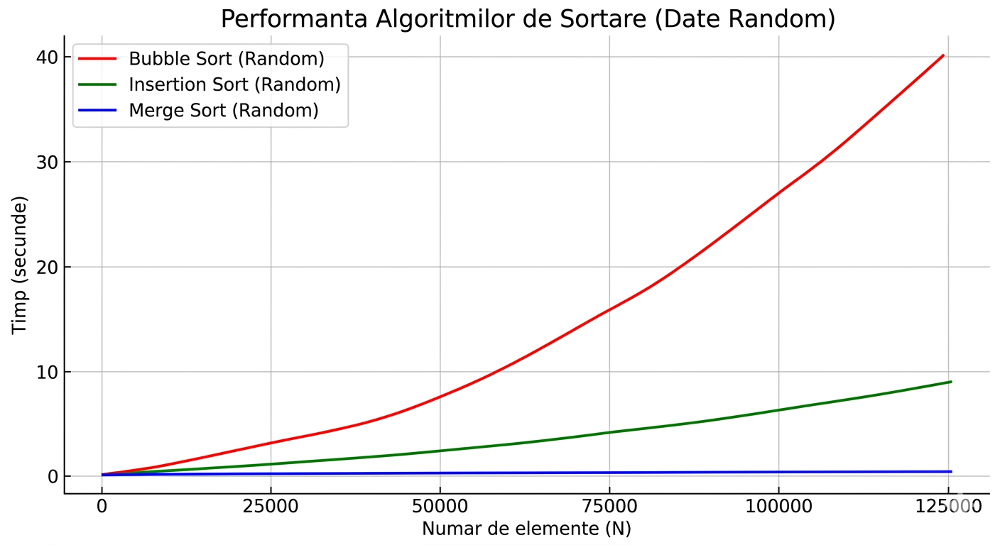

# SortingProject-2026
# Analiza Performantei Algoritmilor de Sortare

Acest proiect reprezinta un studiu experimental care compara eficienta algoritmilor de sortare Bubble Sort, Insertion Sort si Merge Sort. Testarea a fost realizata prin cresterea progresiva a numarului de elemente (N) pana la pragul de 125.000, observand impactul complexitatii algoritmice asupra timpului de executie.

## Algoritmi Analizati

1. **Bubble Sort**: Algoritm bazat pe comparatii succesive. Complexitate: O(n^2).
2. **Insertion Sort**: Eficient pentru seturi mici sau aproape sortate. Complexitate: O(n^2).
3. **Merge Sort**: Algoritm de tip Divide et Impera. Complexitate: O(n log n).

## Metodologie

Programul a fost rulat intr-o bucla continua pentru a genera date si a masura timpii de executie. Pentru fiecare valoare N, au fost testate patru scenarii:
* **Random**: Date generate aleatoriu.
* **Sortat**: Date deja ordonate crescator.
* **Inversat**: Date ordonate descrescator (Worst Case).
* **Aproape Sortat**: Date in care 95% din elemente sunt la locul corect.

## Rezultate Obtinute

Conform datelor inregistrate in `rezultate.csv`, s-au observat urmatoarele performante la pragul de 120.000 de elemente (cazul Random):

| Algoritm | Timp (secunde) |
| :--- | :--- |
| **Merge Sort** | 0.047 s |
| **Insertion Sort** | 8.824 s |
| **Bubble Sort** | 40.332 s |

### Concluzii Experimentale

* **Eficiența O(n log n)**: Merge Sort a demonstrat o stabilitate remarcabila, ramanand sub pragul de 0.1 secunde chiar si la 125.000 de elemente.
* **Impactul structurii datelor**: Pe setul de date "Sortat", Insertion Sort a fost cel mai rapid algoritm (0.0004 s), confirmand eficienta sa in cazurile optime.
* **Limitarile O(n^2)**: Bubble Sort a prezentat o crestere exponentiala a timpului, devenind impracticabil pentru seturi de date mari.



## Instructiuni de Rulare

### Compilare
Utilizati un compilator C standard (de exemplu, GCC):
```bash
gcc main.c -o sort_benchmark
